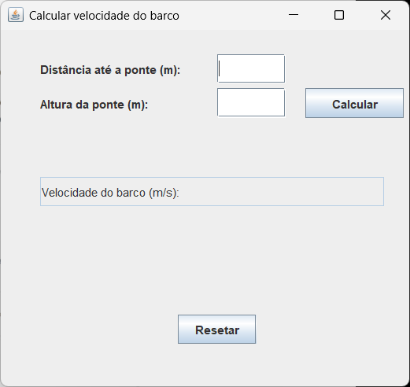
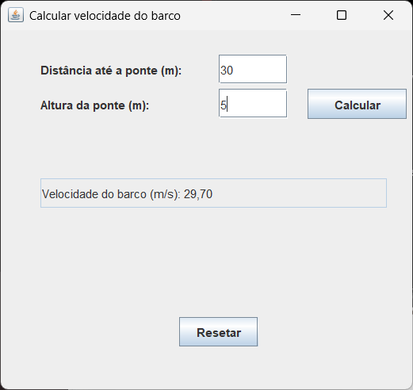

# 🚤 Calculadora Java para exercício de Física – Barco sob a ponte

Uma calculadora simples desenvolvida em Java com interface gráfica (JFrame), projetada para resolver um problema clássico de física: determinar a velocidade que um barco deve ter para estar exatamente sob uma ponte no instante em que um objeto é solto e cai verticalmente.

Com base nas leis do movimento uniformemente acelerado, a ferramenta calcula o tempo de queda livre a partir da altura da ponte e, com isso, determina a velocidade necessária para que o barco percorra uma distância horizontal até o ponto da queda nesse mesmo intervalo de tempo.

Diferentemente de soluções com dados fixos, esta calculadora é interativa e flexível — o usuário pode inserir qualquer valor de distância e altura, permitindo simulações diversas e um aprendizado mais dinâmico dos conceitos físicos envolvidos.

---

## 📸 Capturas de tela

Interface da Calculadora:

Exemplo de Resultado:

Exemplo de Erro:

